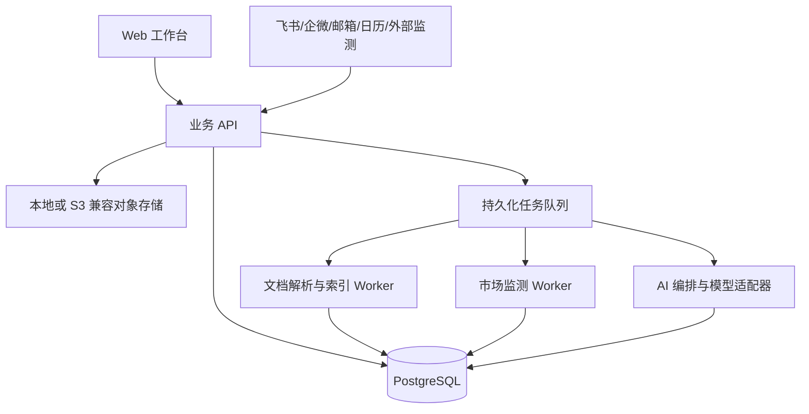

# 技术架构

## 1. 架构目标

- 独立运行，不把飞书、企微或 Agent 框架作为产品底座。
- 本地和私有部署优先，模型和外部连接器可替换。
- 项目状态是事实来源，聊天记录不是事实来源。
- 长任务可恢复、可取消、可审计。
- 原始资料、结构化数据、检索索引和学习规则有一致的权限与删除边界。

## 2. 推荐形态

```text
apps/web        Next.js + TypeScript 工作台
apps/api        Python FastAPI 业务与 AI API
workers         文档解析、索引、监测和长任务
packages/schema 跨前后端数据契约
connectors      飞书、企微、邮箱、日历和数据源适配器
infra           Docker Compose、数据库迁移和部署配置
```

该目录结构是目标架构，技术验证完成前不表示所有组件都必须在 P0 同时出现。

## 3. 系统分层



### Web 工作台

- 项目组合与项目指挥台。
- 方案、交付物、WBS、依赖、甘特图和风险。
- 来源、假设、决策和结果的可视化区分。
- 知识检索、候选经验审批和引用解释。

### 业务 API

- 工作空间、客户、项目、权限和审计。
- 项目状态变更和版本控制。
- 排期与依赖计算。
- 模型、存储和连接器的统一接口。

### Worker

- 文档解析、OCR、分块、向量生成和重建索引。
- 定时监测和提醒。
- 方案解析、影响分析、周报和复盘生成。
- 重试、幂等、超时和取消。

## 4. 存储策略

| 数据 | 默认存储 | 说明 |
|---|---|---|
| 项目、任务、版本、权限 | PostgreSQL | 系统事实来源 |
| 全文与向量索引 | PostgreSQL FTS + pgvector 候选 | P0 避免独立向量数据库 |
| 原始文件和导出物 | 本地文件适配器或 S3 兼容接口 | 不绑定具体对象存储产品 |
| 密钥 | 环境变量或部署方密钥服务 | 不进入数据库、日志和浏览器 |
| 临时解析文件 | 有过期时间的隔离目录 | 任务结束后清理 |

MinIO 当前上游仓库已归档，因此不作为默认承诺。接口保持 S3 兼容，部署方可以选择维护中的实现。

## 5. AI 与工作流

P0 不需要一个通用自主 Agent 框架。先用受约束的任务编排：

1. 明确输入数据和权限范围。
2. 运行单一职责步骤。
3. 生成结构化输出并校验 Schema。
4. 标记事实、假设和缺失信息。
5. 高风险结果进入 `needs_review`。
6. 人工批准后才能改变正式项目状态。

只有在多步骤恢复、分支和人工中断复杂到自研成本明显上升时，再评估 LangGraph 等编排框架。

## 6. 排期与影响引擎

排期引擎必须以确定性逻辑计算日期、依赖、工作日、缓冲和关键路径。模型只能建议任务和工期，不能负责日期算术。

影响引擎使用显式关系：

```text
市场信号 -> 项目假设 -> 决策/方案章节 -> 交付物 -> 任务/里程碑
```

AI 可以建议关系和影响等级，但正式关系需要用户确认。市场变化不能直接修改方案或排期。

## 7. 连接器边界

- 核心产品在没有连接器时可完整使用。
- 飞书 P1：任务、日历、消息和审批通知；使用官方 API 和最小权限。
- 企微 P2：群机器人和企业协作；不模拟个人账号。
- 邮箱/日历 P2：导入更新和提醒。
- 外部监测 P1：RSS、用户指定网页和合法 API。

每个连接器必须支持禁用、权限展示、凭证撤销、失败重试和最后同步时间。

## 8. 部署

P0 交付 Docker Compose：Web、API、Worker、PostgreSQL 和必要的任务队列。提供健康检查、数据库迁移、备份和恢复说明。

托管云、Kubernetes、SSO 和多区域部署不进入 P0。
