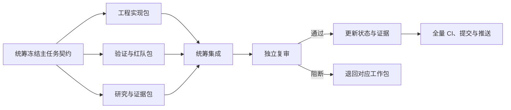

# 多 Agent 项目执行方案

状态：`Active governance`

## 1. 目标与边界

For MarketOps 项目维护者，帮助其在一个主任务内并行完成契约、实现、调研和独立审查，使可并行工作缩短交付周期，同时保持状态、证据、权限与最终决策只有一个事实来源。

这里的多 Agent 用于研发交付，不改变产品定位。MarketOps 产品本身仍是受约束的营销项目工作台，不是通用自主 Agent 平台。

多 Agent 不会按数量等比例提速。M0-04 -> M0-05 -> M0-06 和 M1-01 -> M1-05 仍有严格依赖；只有输入契约已冻结、文件所有权不重叠的工作包可以并行。

## 2. 编制方式

本项目采用六个逻辑岗位、最多四个并发席位。岗位是职责，不等于六个常驻进程；同一 Agent 可以在不同波次切换岗位，但不能在同一工作包中既实现又最终验收。

| 逻辑岗位 | 核心职责 | 明确不负责 |
| --- | --- | --- |
| 项目统筹与集成 | 读取状态、冻结契约、拆包、分配文件、解决冲突、全量检查、更新状态、提交与推送 | 不把自己的实现直接视为独立审查通过 |
| 产品与验收 | 明确用户任务、非目标、人工控制点、成功与失败条件，主持里程碑门 | 不把文档、公开案例或演示当成用户价值验证 |
| 架构与契约 | 定义 Schema、权限范围、版本、错误语义和模块接口 | 不在实现中临时改变已冻结契约 |
| 工程执行 | 在授权路径内实现单一模块并提供可复现证据 | 不修改主进度、验收口径或其他 Agent 的文件 |
| 研究与市场验证 | 核对外部来源、反证和未知项；组织真实任务、复用和付费验证 | 不把网络案例、供应商宣传或口头好评升级为需求事实 |
| 独立审查 | Reviewer 检查范围和架构，QA 复跑正负例，Security/OSS 检查隔离、秘密和许可证 | 不修改被测实现来制造通过结果 |

四个并发席位默认分配如下：

1. 统筹与集成 Agent，始终保留一个席位。
2. 工程或架构 Agent，负责当前实现包。
3. QA、Reviewer 或 Security Agent，独立构造和复跑验收。
4. Research、Product 或 OSS Agent，准备样本、来源和决策证据。

## 3. 工作流



每个主任务按四个波次推进：

| 波次 | 可以并行的工作 | 退出条件 |
| --- | --- | --- |
| 0 契约冻结 | 产品、架构和统筹澄清范围；不得开始正式实现 | 输入、输出、错误、数据范围、样本和验收命令明确 |
| 1 分包执行 | 工程实现、QA 负例设计、Research/OSS 证据准备 | 每个工作包完成交接，不宣告主任务完成 |
| 2 集成验证 | 统筹合并、生成结果、接入 CI、运行全仓检查 | 当前 HEAD 上的结果可复现且没有文件冲突 |
| 3 独立门禁 | 非实现者复跑并检查事实边界、安全和许可证 | 所有阻断项关闭后才更新 `completed` |

## 4. Ready 与 Done

工作包开始前必须满足 Definition of Ready：

- 有主任务 ID、基准 commit 和单一负责人；
- 说明允许修改与禁止修改的路径；
- 输入输出契约、正常场景、失败场景和非目标已经冻结；
- 数据分类、许可、客户隔离与外部模型发送边界明确；
- 已指定非实现者 Reviewer/QA，涉及数据和依赖时指定 Security/OSS；
- 验收命令和预期证据可以由第三方重放。

主任务完成必须满足 Definition of Done：

- 实现、测试夹具、结果摘要和技术限制都已提交；
- 正常、空结果、错误、越权、失效或删除等适用失败路径已覆盖；
- 结果绑定来源 hash、配置 hash 和当前 commit；
- 非实现者在干净环境复跑通过；
- 数据隔离、秘密、许可证和公开仓库边界没有阻断项；
- 主 Agent 运行全仓检查、更新 `project-status.json`、重新生成状态页并等待 GitHub CI；
- 技术验证没有被写成市场需求、效率、ROI 或付费事实。

实现 Agent 的交付状态最多为 `ready_for_review`。只有主 Agent 能在独立审查后把里程碑任务改为 `completed`。

## 5. 文件所有权

| 文件范围 | 默认所有者 |
| --- | --- |
| `project-status.json`、`docs/PROJECT_STATUS.md`、CI 总入口、最终 commit | 统筹与集成 |
| Schema、API 契约、迁移 | 当前唯一架构所有者 |
| `apps/api/**`、`workers/**`、具体引擎脚本 | 被指派的工程 Agent，继续按模块细分 |
| `apps/web/**` 或现有根目录 UI 文件 | 当前唯一 UI Agent |
| 独立 oracle、负向测试和隔离测试 | QA/验证 Agent |
| 公共样本和来源清单 | Research Agent，统筹复核数据使用边界 |
| `OPEN_SOURCE_REVIEW.md`、`THIRD_PARTY_NOTICES.md` | OSS/Security Agent |

以下工作不得并行：同一 Schema 或状态机的双重修改；实现者验收自己的结果；多人同时修改进度源或生成状态页；依赖决策未完成就启动受其约束的产品实现；全仓格式化、依赖升级或迁移与功能开发同时进行。

## 6. 交接格式

每个工作包必须返回：

```text
主任务 / 工作包：
基准 commit：
拥有路径 / 禁止路径：
改动文件：
运行命令与结果：
已确认行为：
合理推测：
限制与未知：
未解决风险：
建议的独立验收证据：
状态：ready_for_review | blocked
```

共享工作树中，子 Agent 不自行提交。统筹必须等待所有写入结束，检查 staged 范围，再统一提交，避免把其他 Agent 的半成品带入 commit。

## 7. 研究证据规则

研究交付使用以下标签：

| 标签 | 含义 | 允许用途 |
| --- | --- | --- |
| `source_fact` | 可回到原始来源的事实 | 构造背景、约束或测试输入 |
| `publisher_claim` | 供应商、品牌或代理商自述 | 作为待验证主张，不作为效果基准 |
| `research_inference` | 基于多项材料的合理推测 | 形成假设、反证或实验问题 |
| `live_observed_result` | 真实目标用户任务中记录的行为 | 在样本和条件明确时支持产品或商业决策 |

Research 向 Engineering 移交的是证据包，不是功能命令。证据包包含来源、摘录、发布方利益关系、事实/推测/未知、允许与禁止用途、反证、待验证行为以及可复现实验输入。Product Agent 批准为决策或验收后，Engineering 才能实施。

## 8. 当前项目编组

| 主任务 | 波次 1 工程 | 波次 1 验证 | 波次 1 研究/安全 | 最终集成 |
| --- | --- | --- | --- | --- |
| M0-04 混合检索 | 作用域过滤、双路评分、引用返回 | 黄金查询、跨客户诱饵、错误范围和确定性检查 | 合成语料、来源/许可边界 | 技术报告、CI、状态更新 |
| M0-05 依赖决策 | 解析、排期、检索候选接口比较 | 替代方案和回退路径 | 许可证、维护、安全与私有部署 | 形成采用/拒绝决策 |
| M0-06 评审门 | 不新增功能 | 复跑全部 M0 证据 | 检查限制是否阻塞 M1 | Go、条件 Go 或 blocked |

M1 的主任务仍顺序执行，但每项内部可以把后端、UI 和独立测试拆成三个工作包。UI 与后端必须使用同一冻结 Schema，不能各自设计后再对接。

## 9. 验证这个机制是否真的提速

这是尚未验证的管理假设。接下来三个主任务记录：

- 实际墙钟时间与 Agent 总工作时间；
- 因契约不清、文件冲突、重复调查产生的返工；
- 独立审查发现的问题数和严重度；
- 单 Agent 预计串行工作包数与实际并行波次；
- CI 首次通过率。

只有并行节省持续大于协调和返工成本，才保留对应岗位。不能用 Agent 数量、输出字数或提交数证明效率。
